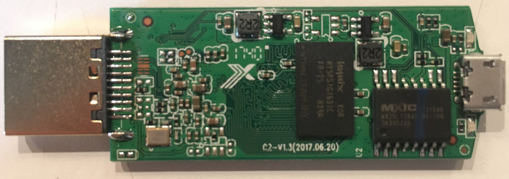
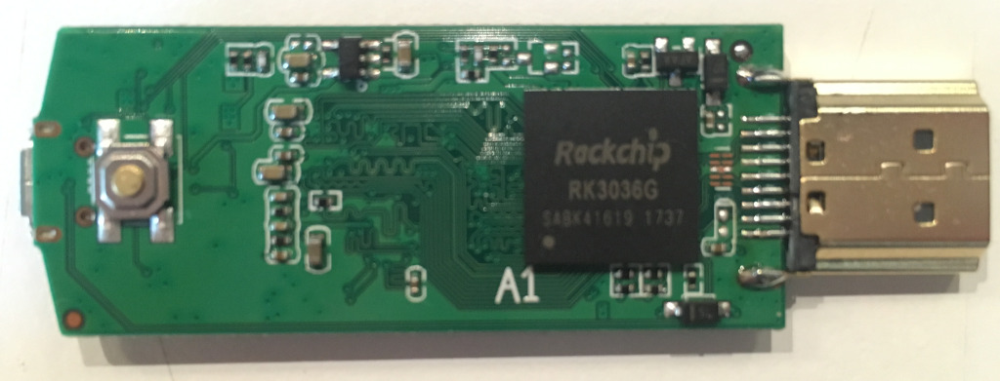

# Rockcast

We're playing with cheap hardware [again](https://github.com/yuvadm/DG-M1Q/). This time it's [this magnificent piece of DLNA/Miracast dongle](https://www.banggood.com/AnyCast-M2-Plus-WiFi-Display-Dongle-Miracast-TV-Dongle-HDMI-DLNA-AirPlay-1080P-p-982127.html) which looks like a Chinesium clone of the Wecast C2.

Since the RK3036 SoC in this device seems to have relatively good open source kernel and toolchain support, it might be a nice target for custom firmware.

## Hardware 

- [Rockchip RK3036](datasheets/rk3036.pdf) Dual core ARM Cortex-A7 SoC
- [Macronix MX25L12845E](datasheets/mx25l12845e.pdf) 16M (128Mbit!) CMOS flash memory
- [Hynix HY5PS1G1631C](datasheets/hy5ps1g1631c.pdf) 1GB DDR2 SDRAM
- [Realtek RTL8188CTV](datasheets/rtl8188ctv.pdf) 802.11n WLAN USB module

### PCB Images




## Dump

Use [Flashrom](https://www.flashrom.org/Flashrom) from latest git master to enjoy significant speedup.

Dumping the flash via Bus Pirate:

```bash
$ flashrom -p buspirate_spi:dev=/dev/ttyUSB0,spispeed=8M -c MX25L12835F/MX25L12845E/MX25L12865E -o log.txt -r rom.bin
```

## Stock Firmware

On boot device attemps to access `http://120.25.100.187:2300/3036/anycast/ksctv/update.img` to download a firmware update.

Update metadata and signature is fetched from `http://120.25.100.187:2300/3036/anycast/ksctv/config.txt`

Binwalking the image provides:

```bash
$ binwalk update.img 

DECIMAL       HEXADECIMAL     DESCRIPTION
--------------------------------------------------------------------------------
269948        0x41E7C         LZO compressed data
270273        0x41FC1         LZO compressed data
2999896       0x2DC658        xz compressed data
3461646       0x34D20E        Unix path: /proc/sys/kernel/domainname0l
3476206       0x350AEE        SHA256 hash constants, little endian
3692204       0x3856AC        SHA256 hash constants, little endian
4456448       0x440000        JFFS2 filesystem, little endian
5242880       0x500000        Squashfs filesystem, little endian, version 4.0, compression:xz, size: 11323710 bytes, 344 inodes, blocksize: 131072 bytes, created: 2018-01-14 00:50:49
```

## Notes

- Booting with button pressed -> mask rom mode
- Booting with SPI out pin 8 shorted to ground -> mask rom mode

## Open Questions

- What the fuck is going on with the storage? Why is the ROM dump so sparse?
- Where are the UART pads / pins hiding?
